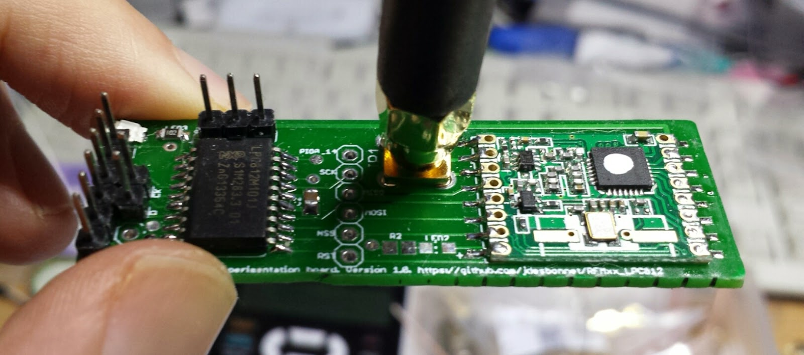
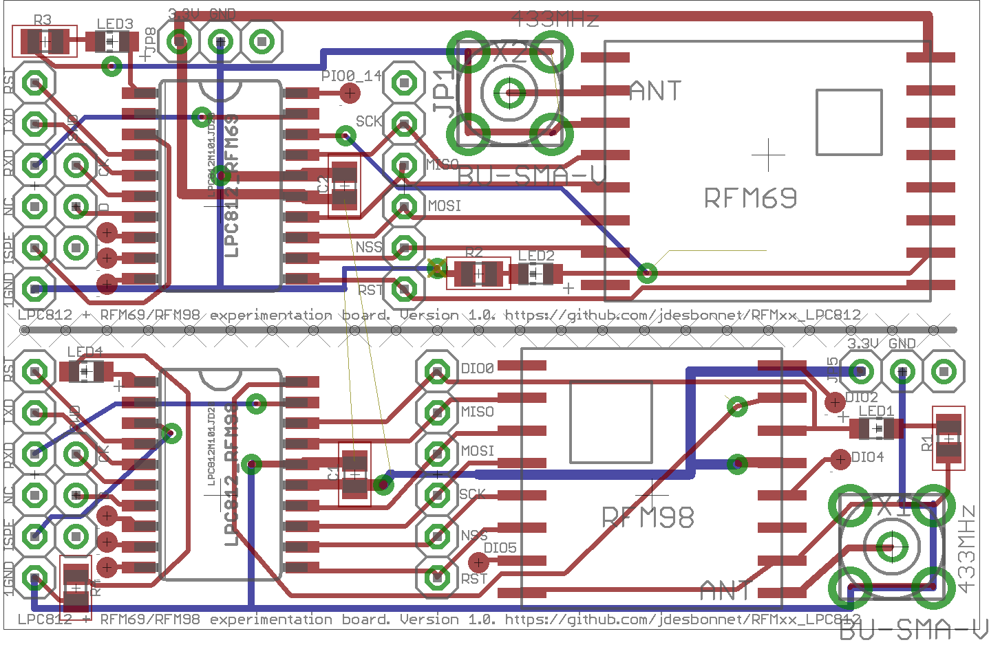
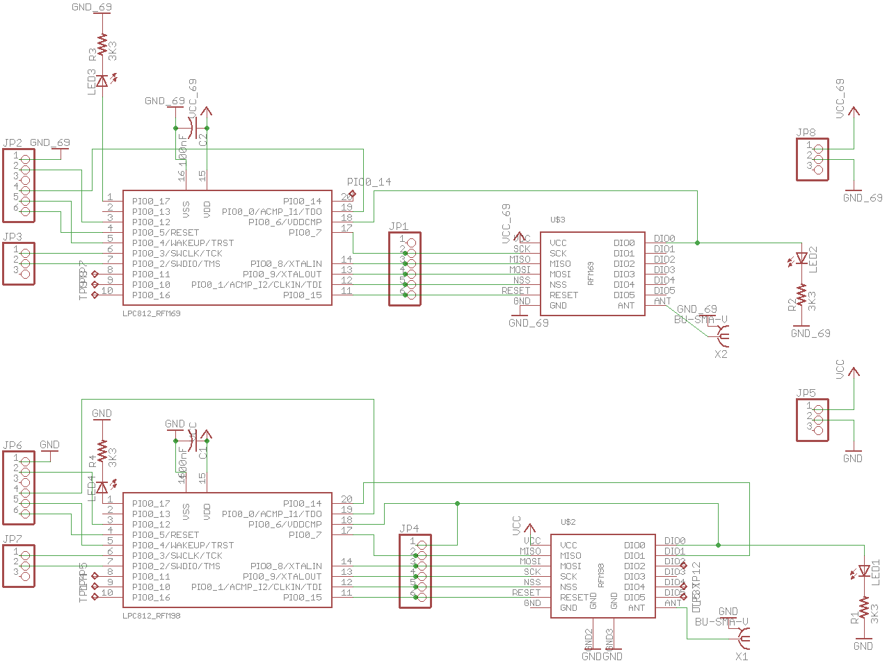
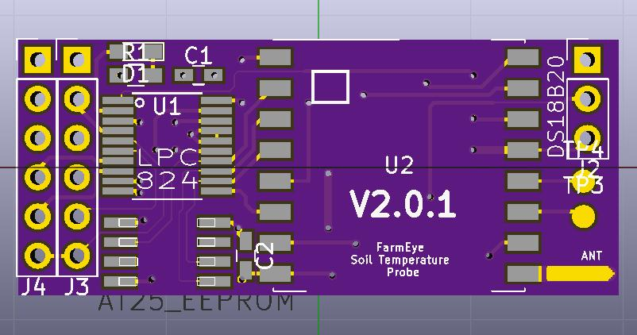

# RFM69HW and RFM98W experimentation board with option for LPC812/LPC824 MCU

This is a PCB board to experiment with HopeRF RFM69HW and RFM98 radio modules (or any modules in that family with a compatible footprint). 

The module can be accessed directly throught JP1 which breaks out the modules SPI bus and a few other pins.

Alternatively a LPC812 (ARM Cortex-M0+ MCU) can be soldered on the board as a controller. Firmware for the LPC812 is here: https://github.com/jdesbonnet/RFM69_LPC812_firmware

There is a blog post discussing this in more detail here: 
http://jdesbonnet.blogspot.ie/2014/12/experiments-with-rfm69-433mhz-digital.html

# Pinout

## Common to RFM69 and RFM98 boards

Leftmost column of 6 pins (from top to bottom): RESET, UART_TXD, UART_RXD, NC, ISP_ENTRY, GND.

Second column from left of 3 pins (from top to bottom): SWD_CLOCK, SWD_DATA, NC.

## RFM69
Three pin row above MCU (from left to right): 3.3V, GND, NC.

## RFM98 
Three pin row at top-right corner of the board (from left to right):  3.3V, GND, NC.

NC: not connect. SWD: serial wire debug. 

# Lessons from first iteration of PCB
 * Keep spacing of headers and test pads snapped to 0.1in grid to facilitate easy construction of bed of nails test rig on proto board.
 * Include power and ground on all headers even if it duplicates.
 * For traces that may become optional use 0 ohm jumper resistors to complete link, or use test pads to allow easy reconnection if a trace needs to be cut (undoing a manually cut trace is a pain).
 * Choice of font on v1 board was too small.
 * Consider side SMA connector
 
 # Version 2 PCB using LPC824
 
 

[Version 2 project files](./RFM98LPC824)
