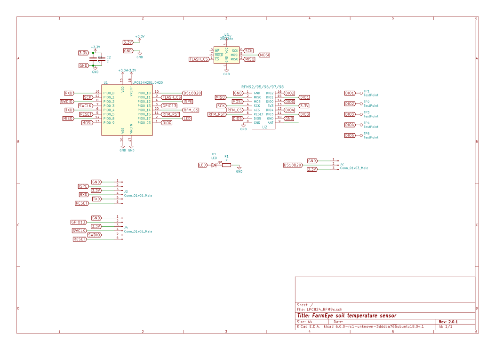

# LPC/RFM radio board version 2

The V2 series replaces the LPC812 with LP824, and adds a SPI flash
IC. 

## V2.0.0 2018-04-14

Improvement on 2014 design: more compact board.

## V2.0.1 2018-04-15

 * Fix missing RFM_CS trace and remove TP for GPIO14 which now has that function. 
 * Minor track layout change to space flash MISO line further from flash MOSI.

V2.0.1 board arrived back from OSHPark on 2018-05-11.

## Header pinouts

(from top to bottom in the redering above)

J3: GND, ISPE, 3.3V, RXD, TXD, RESET

J4: GND, GPIO13, 3.3V, SWCLK, SWDIO, RESET

## Hardware notes:

SPI bus is shared with RFM module and flash IC. Flash IC is 25P16 (or any SPI flash with similar pinout).

| Function | Pin     |  |
|----------|---------|--|
| FLASH_CS | PIO0_11 | This is a hardware bug: PIO0_11 is open drain: cannot drive high w/o external pullup R |
| MOSI     | PIO0_9  |  |
| MISO     | PIO0_8  |  |
| SCK      | PIO0_1  |  |
| RFM_CS   | PIO0_14 |  |
| RFM_RST  | PIO0_15 |  |
| LED      | PIO0_17 |  |
| RFM_DIO0 | PIO0_23 |  |
| DS18B20  | PIO0_10 |  |

Temporary fix for FLASH_CS bug is to route GPIO0_13 from J4 with bodge wire. An alternative approach would be to glue SMD R for pull up to back of PCB. Will shuffle the pins in next PCB to that PIO0_11 is used only for input. Also may have problem with PIO0_10 used for the DS18B20.

DS18B20 confirmed to work. A 0603 4.7K SMD R is soldered between the 3.3V and data on J2. 0603 is about the perfect size for that hack. Unclear if this will have any impact of the deep sleep current consumption.

The external flash IC chosen has a deep-sleep current much larger than what can be achieved with the LPC824 on its own. Seeing something in the order of 20µA (vs 3µA from LPC824 in powerdown). However there are parts which claim much better deep sleep performance eg Macronix MX25R6435F which is pin compatible. http://www.macronix.com/en-us/products/NOR-Flash/Pages/Ultra-Low-Power-Flash.aspx
